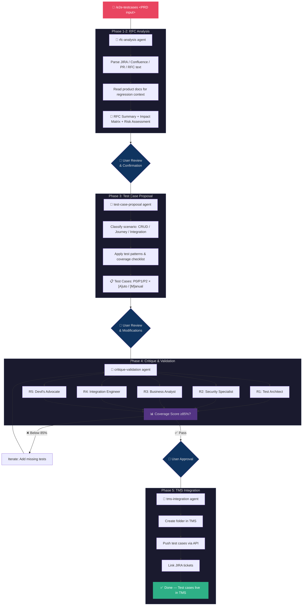
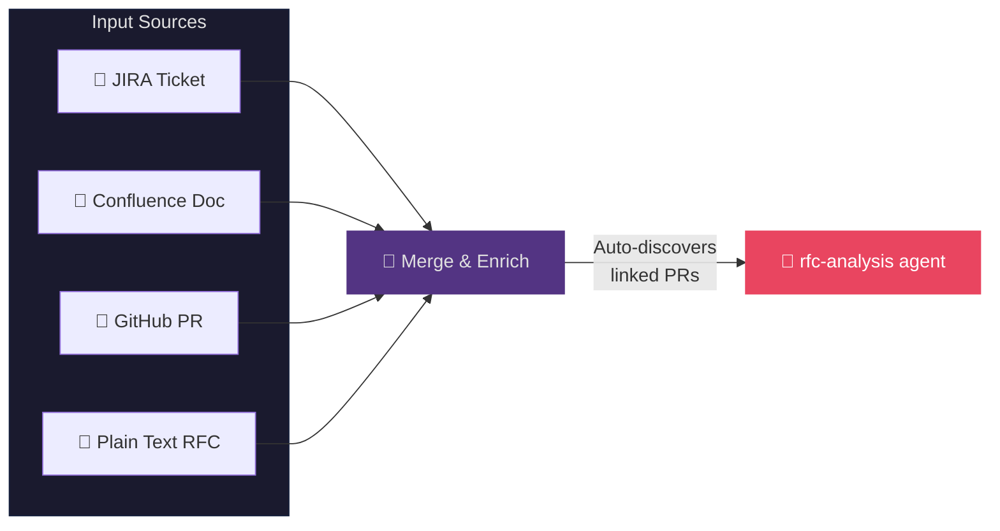
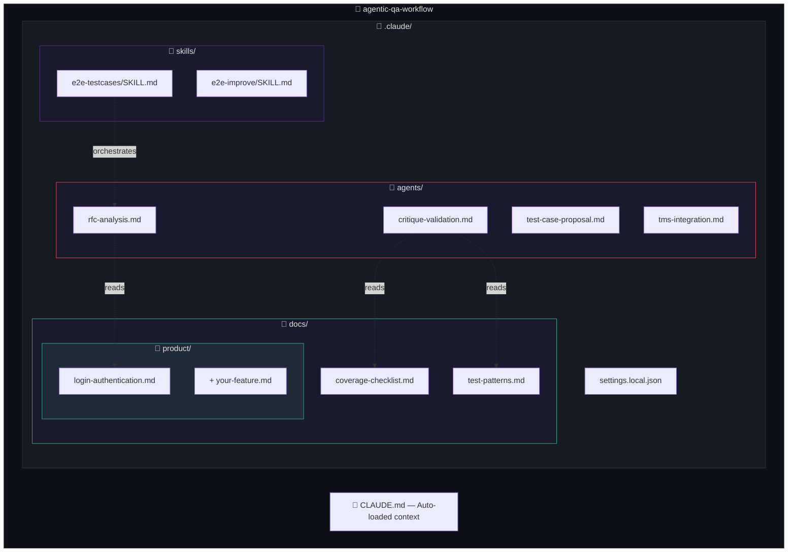
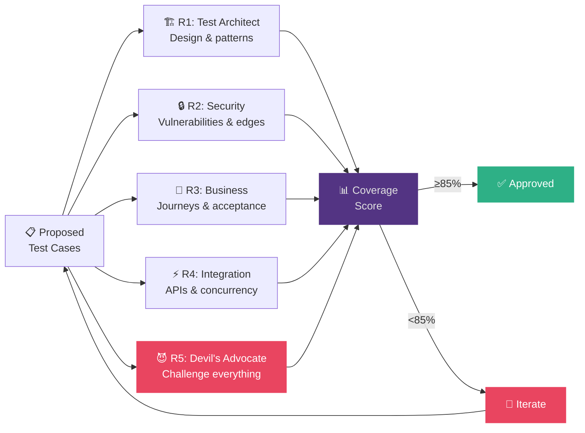

# Agentic QA Workflow

Generate comprehensive, critique-validated test cases from PRDs/RFCs using Claude Code agents.

Feed it a JIRA ticket, Confluence doc, GitHub PR, or plain text requirements — it produces prioritized test cases through a 5-phase pipeline with multi-reviewer critique.

## How It Works



### Agent Pipeline (Text Version)

```
/e2e-testcases <PRD input>
       │
       ├─► Agent: rfc-analysis         → Parses requirements, maps impact & regression risks
       │   ⏸ User reviews
       │
       ├─► Agent: test-case-proposal   → Generates test cases (P0/P1/P2, positive/negative/edge)
       │   ⏸ User reviews
       │
       ├─► Agent: critique-validation  → 5 reviewer personas critique in parallel, scores coverage
       │   ⏸ Must reach ≥85% coverage
       │
       └─► Agent: tms-integration      → Pushes approved test cases to your TMS via API
```

## Input Sources



| Input | Example |
|-------|---------|
| JIRA Ticket | `/e2e-testcases JIRA-5935` |
| Confluence Doc | `/e2e-testcases https://site.atlassian.net/wiki/.../pages/123/Title` |
| GitHub PR | `/e2e-testcases https://github.com/org/repo/pull/42` |
| Plain RFC | `/e2e-testcases Add OAuth2 login with Google and GitHub providers...` |
| Combined | `/e2e-testcases JIRA-5935 https://site.atlassian.net/wiki/.../pages/123` |

## Project Structure



## Quick Start

### Prerequisites

- [Claude Code CLI](https://docs.anthropic.com/en/docs/claude-code) installed
- (Optional) [Atlassian MCP](https://github.com/anthropics/mcp-atlassian-server) for JIRA/Confluence
- (Optional) [GitHub CLI](https://cli.github.com/) for PR context

### Usage

```bash
# Clone and open in Claude Code
git clone https://github.com/<your-username>/agentic-qa-workflow.git
cd agentic-qa-workflow
claude

# Run the test case generation pipeline
/e2e-testcases <your input>
```

## The 5 Phases

### Phase 1-2: RFC Analysis & Impact Assessment (`rfc-analysis` agent)

Parses requirements from any input source. Fetches JIRA details, Confluence pages, linked PRs. Reads product docs to identify regression risks. Produces a structured RFC summary + impact matrix.

### Phase 3: Test Case Proposal (`test-case-proposal` agent)

Classifies the scenario (CRUD, User Journey, Integration, Configuration). Generates test cases across all priorities:
- **P0 Critical**: Happy path, negative, user journeys
- **P1 High**: Edge cases, boundary values
- **P2 Medium**: Regression, cross-feature

Each test case marked `[A] Automatable` or `[M] Manual-Only`.

### Phase 4: Critique & Validation (`critique-validation` agent)



Calculates coverage score. Must reach **≥85% overall** and **100% requirement coverage** to proceed.

### Phase 5: TMS Integration (`tms-integration` agent)

Pushes approved test cases to your Test Management System (TestRail, Zephyr, qTest, Xray, or custom API). Links JIRA tickets for traceability.

## Customization

### Add Your Product Knowledge

Add your product docs as `.md` files in `.claude/docs/product/`. One file per feature area (e.g., `login.md`, `payments.md`, `notifications.md`). See `.claude/docs/product/README.md` for the recommended structure. The more detail you provide about features, flows, edge cases, and API endpoints, the better the test cases.

### Modify Coverage Standards

Edit `.claude/agents/critique-validation.md` to adjust:
- Coverage dimension weights
- Minimum thresholds (default: 85% overall)
- Reviewer personas and focus areas

### Add More Test Patterns

Extend `.claude/docs/test-patterns.md` with domain-specific patterns (e.g., payment flows, file upload, real-time collaboration).

## Claude Code Features Used

| Feature | How It's Used |
|---------|---------------|
| **CLAUDE.md** | Auto-loaded project context every conversation |
| **Skills** (`.claude/skills/`) | `/e2e-testcases` and `/e2e-improve` slash commands |
| **Agents** (`.claude/agents/`) | Specialized subprocesses for each phase |
| **Hooks** (`settings.local.json`) | Phase-gate reminder on stop |
| **MCP Servers** | Atlassian (JIRA/Confluence), Slack, Jam |

## License

MIT
